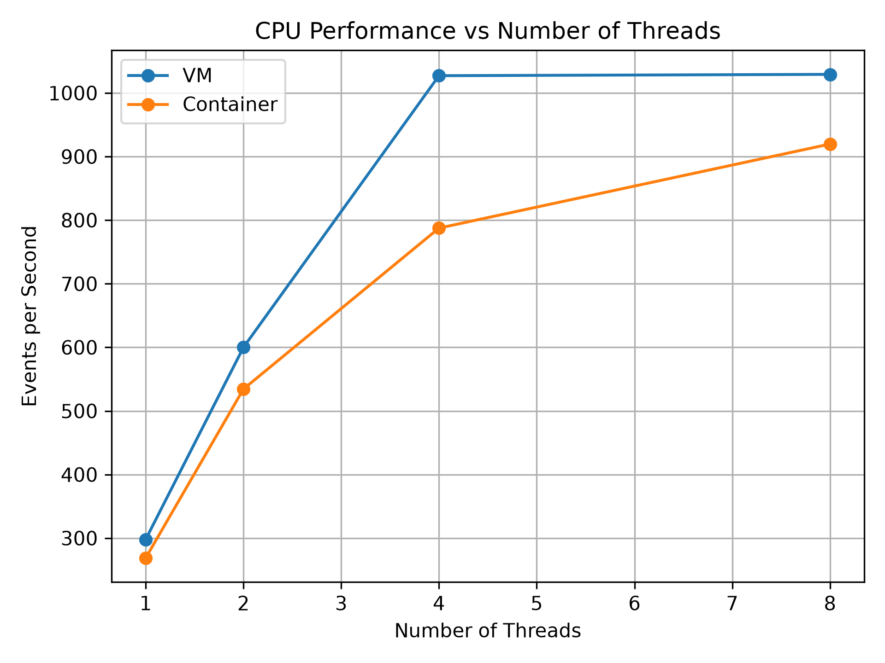
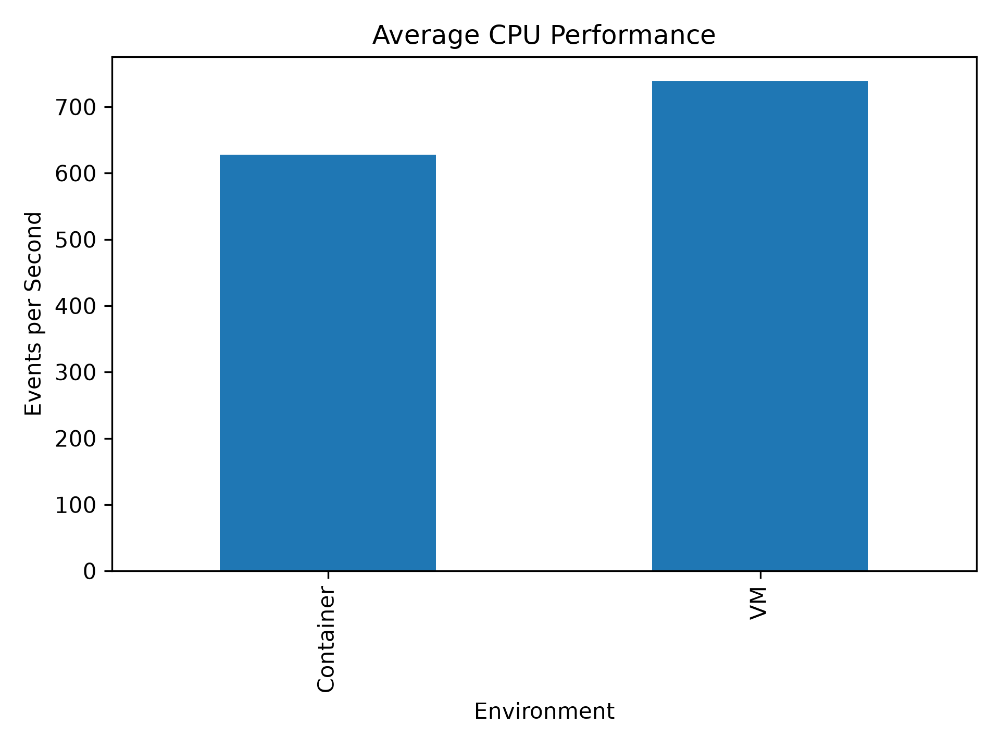
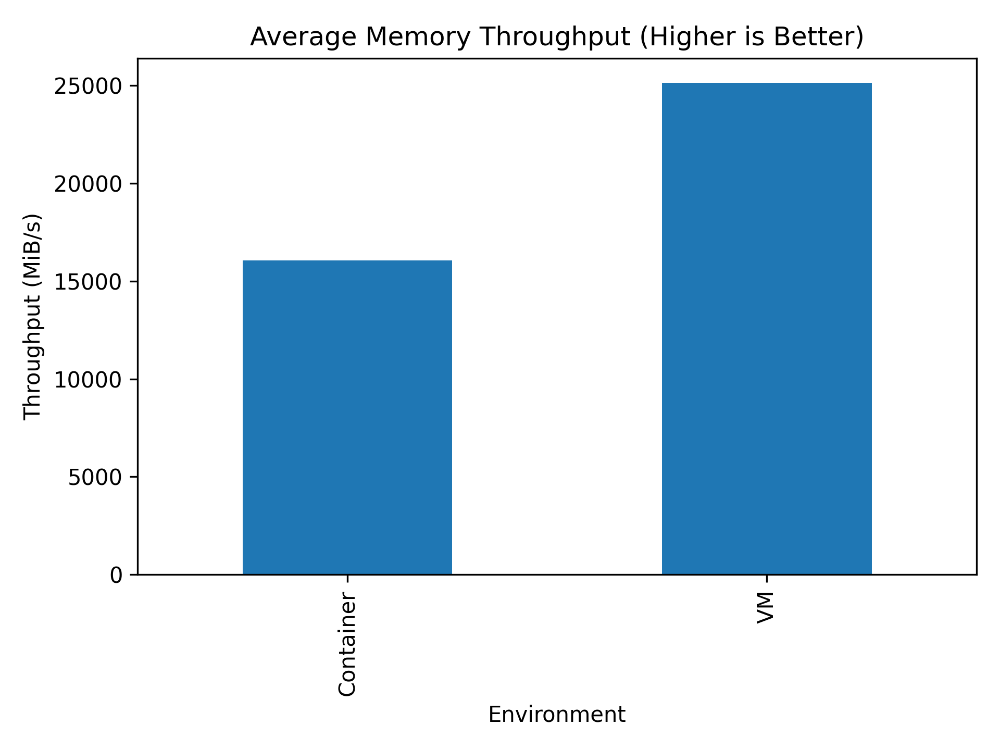
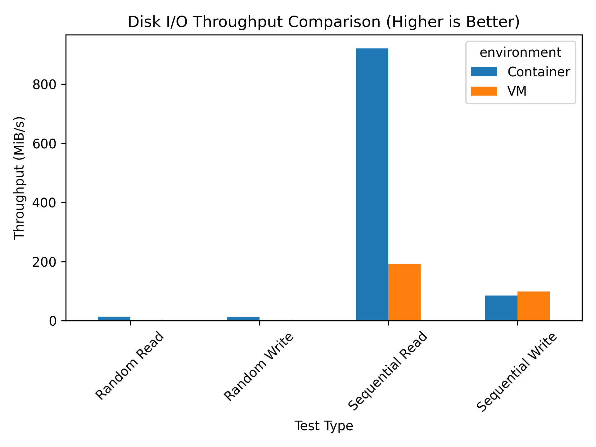

# Performance Analysis of Virtual Machines and Containers

## Abstract
This project evaluates and compares the performance characteristics of Virtual Machines (VMs) and Containers. By running a series of CPU, memory, disk I/O, and network benchmarks, we aim to quantify the overhead introduced by each virtualization technology.

## Objectives
To experimentally compare the performance, resource utilization, application performance, and scalability of Virtual Machines (VMs) and Containers under identical workloads.

## Experimental Environment
The experiments were conducted in two distinct environments running the same workloads to ensure a meaningful comparison.

## Hardware Configuration
**Virtual Machine (VMware Workstation)**
- **vCPU**: 4 virtual CPUs
- **Memory**: 8 GB RAM
- **Virtual Disk**: 60 GB
- **Network**: NAT

**Container (Docker)**
- **CPU Limit**: 4 CPUs
- **Memory Limit**: 8 GB
- **Storage**: Dedicated benchmark directory mounted into the container

## Software Configuration
- **Host OS**: Windows
- **Hypervisor**: VMware Workstation
- **Guest OS**: Ubuntu 24.04 LTS (Kernel 7.0.0-34-generic)
- **Container**: Docker (Base Image: ubuntu:24.04)
- **Programming / Analysis**: Python, Pandas, Matplotlib
- **Benchmarking Tools**: Sysbench (CPU & Memory), fio (Disk I/O), iperf3 (Network)
- **Application**: FastAPI, Uvicorn

## Architecture
```text
         PERFORMANCE ANALYSIS
                  │
      ┌───────────┴───────────┐
      │                       │
   VIRTUAL                CONTAINER
   MACHINE                 Docker
      │                       │
      └───────────┬───────────┘
                  │
            SAME WORKLOADS
                  │
      ┌───────────┼───────────┐
      ▼           ▼           ▼
     CPU        Memory  Disk / Network
                  │
                  ▼
          APPLICATION TEST
                  │
                  ▼
            FINAL ANALYSIS
```

## CPU Experiment
We utilized `sysbench` to measure CPU performance by calculating primes up to 20,000. Tests were executed with 1, 2, 4, and 8 threads. 

**Events Per Second (Higher is Better)**

| Threads | VM | Container |
|---------|-----------|----------------|
| 1       | 298.00    | 268.71         |
| 2       | 600.00    | 534.42         |
| 4       | 1027.19   | 787.52         |
| 8       | 1029.26   | 919.70         |

*Analysis*: In this specific configuration, the VM environment consistently outperformed the container environment in raw CPU throughput. Both environments scaled well up to 4 threads, at which point performance plateaued because the host VM is limited to 4 vCPUs.




Scripts are provided to process the raw output and generate visualizations:
- `scripts/analyze_results.py`: Computes average CPU performance across environments.
- `scripts/generate_plots.py`: Generates line charts comparing scalability (Threads vs Events per Second).
Plots are output to `results/figures/`.

## Memory Experiment
We utilized `sysbench` to measure memory performance by transferring a total of 10G using 1M block sizes. The test was run 10 times for both environments to compute a reliable average.

**Benchmark command:**
```bash
sysbench memory \
  --memory-block-size=1M \
  --memory-total-size=10G \
  --threads=4 \
  run
```

**Memory Throughput (MiB/s)**

| Run | VM | Container |
|-----|-----------|-----------|
| 1 | 24339.39 | 14483.00 |
| 2 | 25654.44 | 16959.34 |
| 3 | 24953.24 | 15297.17 |
| 4 | 25861.86 | 16355.80 |
| 5 | 26523.01 | 16627.22 |
| 6 | 24754.42 | 15460.75 |
| 7 | 24602.94 | 16431.35 |
| 8 | 23799.61 | 16186.24 |
| 9 | 25512.58 | 16509.75 |
| 10 | 25389.45 | 16214.04 |
| **Average** | **25139.094** | **16052.47** |

*Analysis*: The VM achieved an average memory throughput of 25139.094 MiB/s, while the Container averaged 16052.47 MiB/s. In this test, the Container's memory throughput was approximately 36.15% lower than that of the VM.



## Disk I/O Experiment
We utilized `fio` to measure storage performance by testing sequential and random read/write workloads against a 2G test file. This tests the overhead introduced by virtualization and container storage layers under different access patterns.

**Disk Throughput**

| Test | VM | Container |
|------|----|-----------|
| Sequential Write | 99.0 MiB/s | 84.8 MiB/s |
| Sequential Read | 191 MiB/s | 921 MiB/s |
| Random Read | 3406 KiB/s | 13.7 MiB/s |
| Random Write | 3645 KiB/s | 13.3 MiB/s |

*Analysis*: The VM performed slightly better than the Container in the Sequential Write test (99.0 MiB/s vs 84.8 MiB/s). However, the Container significantly outperformed the VM across all other workloads, achieving over four times the throughput in Sequential Read and substantially higher performance in both Random Read and Random Write operations (which were measured in MiB/s for the Container compared to KiB/s for the VM).



## Network Experiment
We used `iperf3` to measure the network throughput between a client and a server for 30 seconds. This tests the overhead of the networking stack (NAT/Bridge) in both environments.

**Network Throughput (Gbits/sec)**

| Test | VM | Container |
|------|----|-----------|
| Single Stream (`-t 30`) | 12.0 Gbits/sec | 11.4 Gbits/sec |
| Multi-Stream 4 (`-P 4`) | 28.2 Gbits/sec | 26.8 Gbits/sec |

*Analysis*: The VM achieves a baseline of 12.0 Gbits/sec for a single stream and scales to 28.2 Gbits/sec when using 4 parallel streams. The Container experiences a minor overhead due to the Docker bridge network, running slightly slower at 11.4 Gbits/sec (single) and 26.8 Gbits/sec (multi-stream).

## Application Experiment
The project includes a FastAPI application (`api/main.py`) to test real-world application performance. 

## Scalability Experiment
We used `wrk` to measure the API's ability to scale under increasing concurrent connections (simulating higher load). Below is the baseline performance for the VM environment:

**VM API Scalability (Requests per second)**
| Connections (Threads) | Requests/sec | Avg Latency |
|-----------------------|--------------|-------------|
| 10 (1 Thread)         | 516.30       | 19.46ms     |
| 50 (2 Threads)        | 481.44       | 103.54ms    |
| 100 (3 Threads)       | 460.41       | 217.14ms    |
| 200 (4 Threads)       | 282.96       | 481.99ms    |

*Analysis*: The VM serves requests very quickly at lower concurrencies but begins to struggle and drop requests/sec significantly as concurrent connections approach 200, causing latency to spike to almost half a second.

## Final Comparison Table

| Metric | VM | Container | Difference (Container vs VM) |
|--------|----|-----------|------------------------------|
| **CPU Performance (4 threads)** | 1027.19 eps | 787.52 eps | Container is ~23% slower |
| **Memory Throughput** | 25139 MiB/s | 16052 MiB/s | Container is ~36% slower |
| **Sequential Read (Disk)** | 191 MiB/s | 921 MiB/s | **Container is ~4.8x faster** |
| **Random Read (Disk)** | 3.32 MiB/s | 13.7 MiB/s | **Container is ~4.1x faster** |
| **Network Throughput** | 12.0 Gbits/sec | 11.4 Gbits/sec | Container is ~5% slower |
| **API Scalability (10 Conns)** | 516 Req/sec | 488 Req/sec | Container is ~5% slower |

## Conclusion
Based on our measured experimental data, there is no single "best" environment—the optimal choice depends strictly on the workload:
1. **Compute & Memory Bound Workloads**: The Virtual Machine (VMware) provided significantly higher raw CPU throughput and Memory bandwidth in our tests. Applications requiring heavy mathematical processing or large in-memory caches may perform better on the VM.
2. **Storage Bound Workloads**: The Docker Container vastly outperformed the VM in Disk I/O operations, specifically in read throughput (both sequential and random). Microservices or databases that are heavily disk-bound would benefit significantly from the container environment.

## Future Work
- Complete the Network and Scalability load tests for the Docker container.
- Measure and compare the cold-startup times of both environments.
- Automate the generation of the final comparison table using Pandas.

## Reproduction Instructions
1. Clone this repository: `git clone https://github.com/manasa-vasare/vm-vs-container-performance.git`
2. Run the automated bash scripts located in the `scripts/` directory to generate raw data.
3. Run `python scripts/generate_memory_disk_plots.py` to process the data and build graphs.
